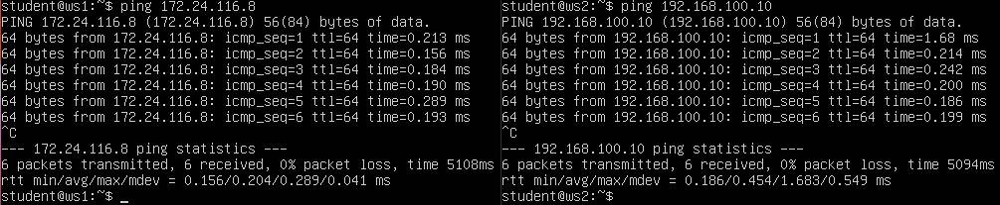
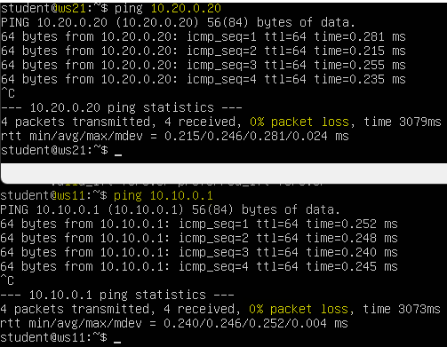

# Linux Network
## Part 1. Инструмент **ipcalc**
- 1.1. Сети и маски    
  - Адрес сети *192.167.38.54/13*  - *192.160.0.0/13*
  - Перевод маски *255.255.255.0* в префиксную и двоичную запись, */15* в обычную и двоичную, *11111111.11111111.11111111.11110000* в обычную и префиксную:
    - *255.255.255.0* = */24* = *11111111.11111111.11111111.00000000*
    - */15* = *255.254.0.0* = *11111111.11111110.00000000.00000000*
    - *11111111.11111111.11111111.11110000* = *255.255.255.240* = */28*
  - Минимальный и максимальный хост в сети *12.167.38.4* при масках:
    - */8*
      - HostMin: *12.0.0.1*
      - HostMax: *12.255.255.254*
    - *11111111.11111111.00000000.00000000*
      - HostMin: *12.167.0.1*
      - HostMax: *12.167.255.254*
    - *255.255.254.0*
      - HostMin: *12.167.38.1*
      - HostMax: *12.167.39.254*
    - */4*
      - HostMin: *0.0.0.1*
      - HostMax: *15.255.255.254*  
___
- 1.2. localhost:
  <details> 
  <summary> LocalHost</summary>
  localhost (так называемый, «местный» от англ. local, или «локальный хост», по смыслу — этот компьютер) — в компьютерных сетях, стандартное, официально зарезервированное доменное имя для частных IP-адресов (в диапазоне 127.0.0.1 — 127.255.255.254). Для сети, состоящей только из одного компьютера, как правило, используется всего один адрес — 127.0.0.1, который устанавливается на специальный сетевой интерфейс «внутренней петли» (англ. loopback) в сетевом протоколе TCP/IP.
  Использование адреса 127.0.0.1 позволяет устанавливать соединение и передавать информацию для программ-серверов, работающих на том же компьютере, что и программа-клиент, независимо от конфигурации аппаратных сетевых средств компьютера (не требуется сетевая карта, модем, и прочее коммуникационное оборудование, интерфейс реализуется при помощи драйвера псевдоустройства в ядре операционной системы). Таким образом, для работы клиент-серверных приложений на одном компьютере не требуется изобретать дополнительные протоколы и дописывать программные модули. Примером может быть запущенный на компьютере веб-сервер и обращение к нему с этого компьютера для веб-разработки на этом компьютере без необходимости выкладывать веб-программу в сеть интернет, пока её разработка не закончена.
  </details>  
  
  - Определить и записать в отчёт, можно ли обратиться к приложению, работающему на localhost, со следующими IP.  
    - *194.34.23.100/16* - __No__  
    - *127.0.0.2/24* - __Yes__  
    - *127.1.0.1/8* - __Yes__  
    - *128.0.0.1/8* - __No__   

___
- 1.3. Диапазоны и сегменты сетей  
  - Какие из перечисленных IP можно использовать в качестве публичного, а какие только в качестве частных: 
    *10.0.0.45/8* - __private__  
    *134.43.0.2/16* - __public__  
    *192.168.4.2/16* - __private__  
    *172.20.250.4/12* - __private__  
    *172.0.2.1/12* - __public__  
    *192.172.0.1/12* - __public__  
    *172.68.0.2/12* - __public__  
    *172.16.255.255/12* - __private__  
    *10.10.10.10/8* - __private__  
    *192.169.168.1/16* - __public__  
  - Какие из перечисленных IP адресов шлюза возможны у сети *10.10.0.0/18*:   
    *10.0.0.1* - __no__  
    *10.10.0.2* - __yes__  
    *10.10.10.10* - __yes__  
    *10.10.100.1* - __no__  
    *10.10.1.255* - __yes__  
___
## Part 2. Статическая маршрутизация между двумя машинами
- Поднять две виртуальные машины (далее -- ws1 и ws2)  
  - С помощью команды `ip a` посмотреть существующие сетевые интерфейсы  
    <__Screenshot 1.__ Result of using command `ip a` on VM's `ws1` & `ws2`>  
      

  - Описать сетевой интерфейс, соответствующий внутренней сети, на обеих машинах и задать следующие адреса и маски: ws1 - *192.168.100.10*, маска */16*, ws2 - *172.24.116.8*, маска */12*:  
    <__Screenshot 2.__ Cодержание изменённого файла *etc/netplan/00-installer-config.yaml*.>    
      
  - Выполнить команду `netplan apply` для перезапуска сервиса сети  
    <__Screenshot 3.__ Вызов и вывод команды `netplan apply`>  
      
  
- 2.1. Добавление статического маршрута вручную
  - Добавить статический маршрут от одной машины до другой и обратно при помощи команды вида `ip r add`
  - Пропинговать соединение между машинами  
    <__Screenshot 4.__ Ping `ws1` to `ws2` && `ws2` to `ws1`>  
      
    Использованная команда: `sudo ip r add <ip-address1> via <ip-address2> dev enp0s3`

- 2.2. Добавление статического маршрута с сохранением
  - Перезапустить машины  
  - Добавить статический маршрут от одной машины до другой с помощью файла *etc/netplan/00-installer-config.yaml*  
    <__Screenshot 5.__ Add static route `ws1` to `ws2` && `ws2` to `ws1`>  
      
  - Пропинговать соединение между машинами  
    <__Screenshot 6.__ Ping `ws1` to `ws2` && `ws2` to `ws1`>  
      
___
## Part 3. Утилита **iperf3**
- 3.1. Скорость соединения   
  - 8 Mbps в MB/s: 1 MB/s
  - 100 MB/s в Kbps:  819200 Kbps
  - 1 Gbps в Mbps: 1024 Mbps

- 3.2. Утилита **iperf3**  
  - Измерить скорость соединения между ws1 и ws2  
  - В отчёт поместить скрины с вызовом и выводом использованных команд.
    Добавляем стандартный порт(`5201`) утилиты `iperf3` в исключения брандмауэра/firewall.  
    `sudo ufw allow 5201`  
    На одной из машин запускаем `iperf` в качестве сервера - `iperf3 -s`  
    На другой подключаемся к нему - `iperf3 -c <ip-address>`  
    <__Screenshot 7.__ `iperf3` util>  
    
___
## Part 4. Сетевой экран
- 4.1. Утилита **iptables**
  - Создать файл */etc/firewall.sh*, имитирующий фаерволл, на ws1 и ws2:
    ```shell
    #!/bin/sh

    # Удаление всех правил в таблице "filter" (по-умолчанию).
    iptables –F
    iptables -X
    ```
- Нужно добавить в файл подряд следующие правила:
  1) на ws1 применить стратегию когда в начале пишется запрещающее правило, а в конце пишется разрешающее правило (это касается пунктов 4 и 5)
  2) на ws2 применить стратегию когда в начале пишется разрешающее правило, а в конце пишется запрещающее правило (это касается пунктов 4 и 5)
  3) открыть на машинах доступ для порта 22 (ssh) и порта 80 (http)
  4) запретить *echo reply* (машина не должна "пинговаться”)
  5) разрешить *echo reply* (машина должна "пинговаться")  
  <__Screenshot 8.__ Содержание файлов */etc/firewall*>    
    
  - Запустить файлы на обеих машинах командами `chmod +x /etc/firewall.sh` и `/etc/firewall.sh`  
  <__Screenshot 9.__ Просмотр правил фильтрации `iptables`>   
    
  Правила, в списке `iptables` проверяются последовательно и, если условие подходит, то выполняется действие. На первой машине первым правилом установлен запрет на пакеты пингования, и когда такой пакет поступает на вход `iptables`, система выполняет условие и не отправляет ответ. На второй машине это правило наоборот, разрешено и она отправляет ответ, это видно на __Screenshot 9__ при пинговании машинами друг друга. 

- 4.2. Утилита **nmap**
  - Командой **ping** найти машину, которая не "пингуется", после чего утилитой **nmap** показать, что хост машины запущен
*Проверка: в выводе nmap должно быть сказано: `Host is up`*
  - В отчёт поместить скрины с вызовом и выводом использованных команд **ping** и **nmap**.  
  <__Screenshot 10.__ Пинг машины с запретом на пинг>   
    
  <__Screenshot 11.__ `NMAP` машины с запретом на пинг>   
    

  - Сохранить дампы образов виртуальных машин

___
## Part 5. Статическая маршрутизация сети
- Поднять пять виртуальных машин (3 рабочие станции (ws11, ws21, ws22) и 2 роутера (r1, r2))
- 5.1. Настройка адресов машин
  - Настроить конфигурации машин в *etc/netplan/00-installer-config.yaml* согласно сети на рисунке.  
    <__Screenshot 12.__ Cодержание файла *etc/netplan/00-installer-config.yaml*>   
      
  - Перезапустить сервис сети. Если ошибок нет, то командой `ip -4 a` проверить, что адрес машины задан верно.  
    <__Screenshot 13.__ Вывод команды `ip -4 a` для каждой машины>   
        
    Также пропинговать ws22 с ws21. Аналогично пропинговать r1 с ws11.  
    <__Screenshot 14.__ Пингование машин. С ws21 -> ws22; C ws11 -> r1>   
         

- 5.2. Включение переадресации IP-адресов.
  - Для включения переадресации IP, выполните команду на роутерах:
    `sysctl -w net.ipv4.ip_forward=1`  
    *При таком подходе переадресация не будет работать после перезагрузки системы.*  
    <__Screenshot 15.__ Использование команды `sysctl -w net.ipv4.ip_forward=1`>   
       

  - Откройте файл */etc/sysctl.conf* и добавьте в него следующую строку:
    `net.ipv4.ip_forward = 1`  
    *При использовании этого подхода, IP-переадресация включена на постоянной основе.*  
    содержанием файла */etc/sysctl.conf*.  
    <__Screenshot 16.__ Содержание файла */etc/sysctl.conf*>    
         

- 5.3. Установка маршрута по-умолчанию
  Пример вывода команды `ip r` после добавления шлюза:
  ```
  default via 10.10.0.1 dev eth0
  10.10.0.0/18 dev eth0 proto kernel scope link src 10.10.0.2
  ```
  - Настроить маршрут по-умолчанию (шлюз) для рабочих станций. Для этого добавить gateway4 \[ip роутера\] в файле конфигураций  
    <__Screenshot 17.__ Содержание файла *etc/netplan/00-installer-config.yaml*>    
      
  - Вызвать `ip r` и показать, что добавился маршрут в таблицу маршрутизации  
    <__Screenshot 18.__ Результат вызова команды `ip r`>    
       
  - Пропинговать с ws11 роутер r2 и показать на r2, что пинг доходит. Для этого использовать команду:
    `tcpdump -tn -i enp0s3`  
    <__Screenshot 19.__ Пингование r2 с ws11 и просмотр пакетов приходящих на r2>    
    

- 5.4. Добавление статических маршрутов
  - Добавить в роутеры r1 и r2 статические маршруты в файле конфигураций. Пример для r1 маршрута в сетку 10.20.0.0/26:
    ```shell
    # Добавить в конец описания сетевого интерфейса eth1:
    - to: 10.20.0.0
      via: 10.100.0.12
    ```  
    <__Screenshot 20.__ Содержание файла *etc/netplan/00-installer-config.yaml* для r1 и r2>    
      
  - Вызвать `ip r` и показать таблицы с маршрутами на обоих роутерах. Пример таблицы на r1:
    ```
    10.100.0.0/16 dev eth1 proto kernel scope link src 10.100.0.11
    10.20.0.0/26 via 10.100.0.12 dev eth1
    10.10.0.0/18 dev eth0 proto kernel scope link src 10.10.0.1
    ```  
    <__Screenshot 21.__ Вывод команды `ip r` для r1 и r2>    
      

  - Запустить команды на ws11:  
    `ip r list 10.10.0.0/[маска сети]` и `ip r list 0.0.0.0/0`  
    <__Screenshot 22.__ Вывод команды `ip r list 10.10.0.0/[маска сети]` и `ip r list 0.0.0.0/0` для ws11>    
         
    Для адреса 10.10.0.0/18 был выбран маршрут, отличный от 0.0.0.0/0, хотя он попадает под маршрут по-умолчанию потому, что стандартный(default) маршрут выполняется
    в том случае, если не подходят другие маршруты в таблице. Поскольку у нас выполнилось установленное правило, стандартный маршрут не сработал. 

- 5.5. Построение списка маршрутизаторов.   
  Пример вывода утилиты **traceroute** после добавления шлюза:
    ```
    1 10.10.0.1 0 ms 1 ms 0 ms
    2 10.100.0.12 1 ms 0 ms 1 ms
    3 10.20.0.10 12 ms 1 ms 3 ms
    ```
  - Запустить на r1 команду дампа:  
  `tcpdump -tnv -i enp0s3`  
  - При помощи утилиты **traceroute** построить список маршрутизаторов на пути от ws11 до ws21  
    <__Screenshot 23.__ Вывод команд `tcpdump -tnv -i enp0s3` и `tracerout 10.20.0.10`>    
      
    <details> 
    <summary> traceroute </summary>  
    Traceroute обрисовывает путь, по которому IP-пакет следует к хосту, запуская тестовые пакеты UDP с небольшим TTL (время жизни), а затем прослушивая ICMP-ответ «превышено время» от шлюза. Мы запускаем наши тесты с TTL=1 и увеличиваем его на единицу, пока не получим ICMP «порт недоступен» (что означает, что пакет прибыл в пункт назначения) или не достигнем максимального значения попыток, которое по умолчанию составляет 30.
    </details>   

- 5.6. Использование протокола **ICMP** при маршрутизации  
  - Запустить на r1 перехват сетевого трафика, проходящего через eth0 с помощью команды:  
  `tcpdump -n -i eth0 icmp`  
  - Пропинговать с ws11 несуществующий IP (например, *10.30.0.111*) с помощью команды:  
  `ping -c 1 10.30.0.111`  
  <__Screenshot 24.__ Вывод команд `tcpdump -n -i eth0 icmp` и `ping -c 1 10.30.0.111`>    
      
  - Сохранить дампы образов виртуальных машин.
___
## Part 6. Динамическая настройка IP с помощью **DHCP**
- Указать MAC адрес у ws11, для этого в *etc/netplan/00-installer-config.yaml* надо добавить строки: `macaddress: 10:10:10:10:10:BA`, `dhcp4: true`  
  <__Screenshot 25.__ Содержание изменённого файла *etc/netplan/00-installer-config.yaml* для ws11>    
       
- Для r2 настроить в файле */etc/dhcp/dhcpd.conf* конфигурацию службы **DHCP**:
  - указать адрес маршрутизатора по-умолчанию, DNS-сервер и адрес внутренней сети. Пример файла для r2:
    ```shell
    subnet 10.100.0.0 netmask 255.255.0.0 {}
    subnet 10.20.0.0 netmask 255.255.192.0
    {
        range 10.20.0.2 10.20.0.50;
        option routers 10.20.0.1;
        option domain-name-servers 10.20.0.1;
    }
    ```
    <__Screenshot 26.__ Содержание изменённого файла */etc/dhcp/dhcpd.conf* для r2>    
      
  - в файле *resolv.conf* прописать `nameserver 8.8.8.8.`   
    <__Screenshot 27.__ Содержание изменённого файла *resolv.conf* для r2>    
      
- Перезагрузить службу **DHCP** командой `systemctl restart isc-dhcp-server`. Машину ws21 перезагрузить при помощи `reboot` и через `ip a` показать, что она получила адрес. Также пропинговать ws22 с ws21.  
  <__Screenshot 28.__ Перезагрузка службы DHCP>    
    
  <__Screenshot 29.__ Пингование ws22 с ws21>    
    
- Для r1 настроить аналогично, но сделать выдачу адресов с жесткой привязкой к MAC-адресу (ws11). Провести аналогичные тесты  
  <__Screenshot 30.__  Содержание изменённого файла */etc/dhcp/dhcpd.conf* для r1>    
    
  <__Screenshot 31.__ Содержание изменённого файла *resolv.conf* для r1>  
    
  <__Screenshot 32.__ Пингование ws22 с ws11>    
    
- Запросить с ws21 обновление ip адреса  
  <__Screenshot 33.__ Обновление ip для машины ws21, ip до и после>    
    
  Для обновления ip с помощью службы DHCP, сначала необходимо освободить адрес для сетевого адаптера `enp0s3`, с помощью команды `sudo dhclient -r enp0s3`.  
  После чего ip можно получить с помощью команды `sudo dhclient enp0s3`
- Сохранить дампы образов виртуальных машин
___
## Part 7. **NAT**
- В файле */etc/apache2/ports.conf* на ws22 и r2 изменить строку `Listen 80` на `Listen 0.0.0.0:80`, то есть сделать сервер Apache2 общедоступным  
  <__Screenshot 34.__ Содержание файла */etc/apache2/ports.conf* для ws22 и r2>      
    
- Запустить веб-сервер Apache командой `service apache2 start` на ws22 и r1  
  <__Screenshot 35.__ Вызов и вывод команды  `service apache2 start` на ws22 и r1>      
      
- Добавить в фаервол, созданный по аналогии с фаерволом из Части 4, на r2 следующие правила:
  1) Удаление правил в таблице filter - `iptables -F`
  2) Удаление правил в таблице "NAT" - `iptables -F -t nat`
  3) Отбрасывать все маршрутизируемые пакеты - `iptables --policy FORWARD DROP`
     - Запускать файл также, как в Части 4  
     - Проверить соединение между ws22 и r1 командой `ping`  
       *При запуске файла с этими правилами, ws22 не должна "пинговаться" с r1*   
       <__Screenshot 36.__ Проверка пинга с ws22 на r1 и наоборот>      
         
       <__Screenshot 37.__ Правило фильтрации для r2>      
       
  4) Разрешить маршрутизацию всех пакетов протокола **ICMP**
      - Запускать файл также, как в Части 4
      - Проверить соединение между ws22 и r1 командой `ping`  
        *При запуске файла с этими правилами, ws22 должна "пинговаться" с r1*  
        <__Screenshot 38.__ Проверка пинга с ws22 на r1 и наоборот>      
          
        <__Screenshot 39.__ Правило фильтрации для r2>       
         
  5) Включить **SNAT**, а именно маскирование всех локальных ip из локальной сети, находящейся за r2 (по обозначениям из Части 5 - сеть 10.20.0.0)
    *Совет: стоит подумать о маршрутизации внутренних пакетов, а также внешних пакетов с установленным соединением*
  6) Включить **DNAT** на 8080 порт машины r2 и добавить к веб-серверу Apache, запущенному на ws22, доступ извне сети
      *Совет: стоит учесть, что при попытке подключения возникнет новое tcp-соединение, предназначенное ws22 и 80 порту*    
  <__Screenshot 40.__ Содержание изменённого файла *firewall.sh*>       
    
    - Запускать файл также, как в Части 4
      *Перед тестированием рекомендуется отключить сетевой интерфейс **NAT** (его наличие можно проверить командой `ip a`) в VirtualBox, если он включен*  
    - Проверить соединение по TCP для **SNAT**, для этого с ws22 подключиться к серверу Apache на r1 командой:  
      `telnet [адрес] [порт]`  
    - Проверить соединение по TCP для **DNAT**, для этого с r1 подключиться к серверу Apache на ws22 командой `telnet` (обращаться по адресу r2 и порту 8080)  
      <__Screenshot 41.__ Проверка соединения по `tcp` с помощью `telnet`>       
       
- Сохранить дампы образов виртуальных машин
___
## Part 8. Дополнительно. Знакомство с **SSH Tunnels**
- Запустить веб-сервер **Apache** на ws22 только на localhost (то есть не изменять файл */etc/apache2/ports.conf* или, если был изменен ранее, вернуть строку `Listen 80`)
- Воспользоваться *Local TCP forwarding* с ws21 до ws22, чтобы получить доступ к веб-серверу на ws22 с ws21  
  <__Screenshot 42.__ Использование *Local TCP forwarding* с ws21 до ws22>       
   
- Воспользоваться *Remote TCP forwarding* c ws11 до ws22, чтобы получить доступ к веб-серверу на ws22 с ws11  
  <__Screenshot 43.__ Использование *Remote TCP forwarding* c ws11 до ws22>       
   
- Для проверки, сработало ли подключение в обоих предыдущих пунктах, перейдите во второй терминал (например, клавишами Alt + F2) и выполните команду:
  `telnet 127.0.0.1 [локальный порт]`  
  <__Screenshot 44.__ Проверка подключения с ws21 к ws22 при помощи `telnet 127.0.0.1 [локальный порт]`>       
    
  <__Screenshot 45.__ Проверка подключения с ws11 к ws22 при помощи `telnet 127.0.0.1 [локальный порт]`>       
    
- Сохранить дампы образов виртуальных машин